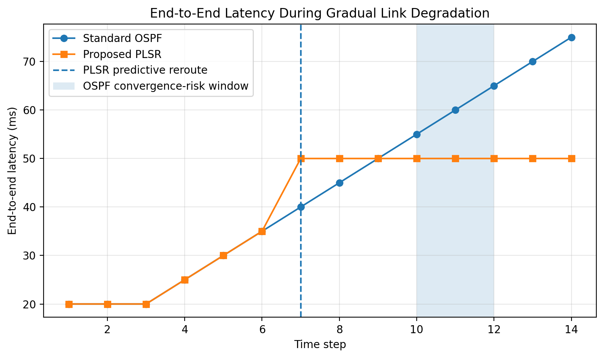

<<<<<<< HEAD
# Predictive Link-State Routing (PLSR) Simulation Files

This folder contains the simulation source code and generated evidence files for the EN2150 Routing Protocol Design report.

## Protocol Summary

The proposed protocol is **Predictive Link-State Routing (PLSR)**. It improves standard OSPF-style link-state routing by:

1. Monitoring current latency against a baseline latency.
2. Smoothing measurements using EWMA.
3. Predicting link degradation using latency trend.
4. Increasing dynamic route cost before complete failure.
5. Sending signed predictive Link State Updates (pLSUs).
6. Verifying pLSUs using HMAC-SHA256 and sequence numbers.

## Folder Structure

```text
PLSR_Project_Files/
├── figures/
│   ├── topology_diagram.png
│   ├── latency_comparison.png
│   ├── pdr_comparison.png
│   ├── control_overhead.png
│   └── security_verification.png
├── src/
│   └── plsr_simulation.py
└── results/
    ├── simulation_log.txt
    ├── simulation_summary.csv
    └── console_output.txt
├── README.md
```

## How to Run

### Step 1: Install dependencies

```bash
pip install -r requirements.txt
```

### Step 2: Run the simulation

```bash
python plsr_simulation.py
```

or:

```bash
python src/plsr_simulation.py
```

## Expected Output

The terminal shows OSPF and PLSR path choices at each time step.

Expected behavior:

- At early time steps, both OSPF and PLSR use the primary route: `R0 -> R1 -> R3`.
- When the `R1 -> R3` link starts degrading, OSPF stays on the primary route because it uses static/base cost.
- PLSR detects degradation and switches to: `R0 -> R2 -> R3`.
- Security output should show:
  - `Valid pLSU accepted: True`
  - `Forged pLSU accepted: False`

## Figures Used in Report

1. `figures/topology_diagram.png` — primary and backup paths.
2. `figures/latency_comparison.png` — OSPF latency rises while PLSR stabilizes after predictive rerouting.
3. `figures/pdr_comparison.png` — Packet Delivery Ratio comparison.
4. `figures/control_overhead.png` — control-plane overhead comparison.
5. `figures/security_verification.png` — HMAC verification result.

## LaTeX Figure Example

```latex
\begin{figure}[H]
    \centering
    \includegraphics[width=0.85\textwidth]{figures/latency_comparison.png}
    \caption{End-to-end latency comparison between standard OSPF and proposed PLSR.}
    \label{fig:latency-comparison}
\end{figure}
```
=======
# Predictive Link-State Routing (PLSR)

<p align="center">
  <b>A proactive routing protocol simulation for EN2150 Communication Network Engineering</b>
</p>

<p align="center">
  
</p>

---

## 📌 Project Overview

This repository contains the simulation files for **Predictive Link-State Routing (PLSR)**, a proposed routing protocol designed for the EN2150 Communication Network Engineering routing protocol design assignment.

Traditional link-state routing protocols such as **OSPF** normally react after a link failure or major topology change has already occurred. This reactive behavior can cause packet loss, routing blackholes, and temporary service degradation.

PLSR improves this behavior by monitoring link latency trends and predicting degradation before complete failure. When a link begins to behave abnormally, PLSR increases its dynamic routing cost and reroutes traffic through a healthier backup path.

---

## 🚀 Key Features

- Predictive link degradation detection
- Dynamic routing cost calculation
- EWMA-based latency smoothing
- Proactive rerouting before failure
- HMAC-SHA256 secured predictive Link State Updates
- Sequence-number based replay protection
- OSPF-style baseline comparison
- Python and NetworkX based simulation
- Automatically generated graphs and result logs

---

## 🧠 Proposed Protocol: PLSR

PLSR stands for **Predictive Link-State Routing**.

The protocol extends the idea of traditional link-state routing by introducing predictive monitoring. Instead of waiting for a link to fully fail, each router continuously observes link latency and compares it with a baseline value.

The PLSR cost model considers:

```text
Smoothed latency
Latency deviation from baseline
Latency trend
Packet loss penalty
>>>>>>> 2e48cd7b1915a1f11e84d08dbf30eaa5ed5b845f
